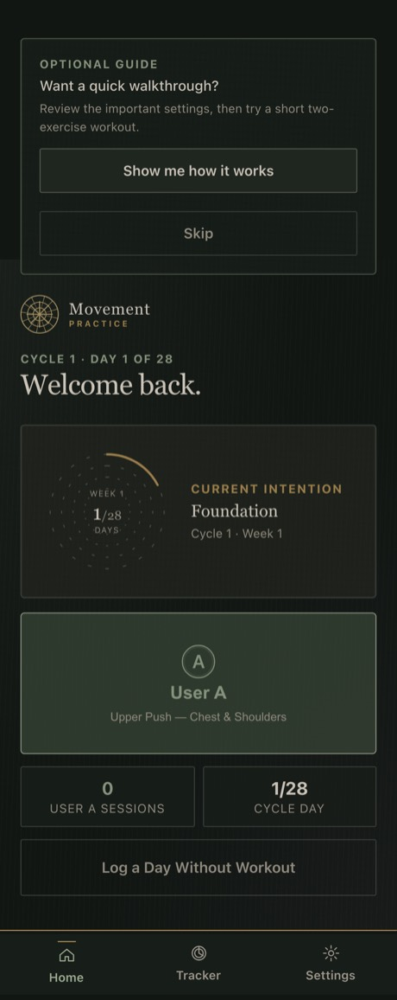
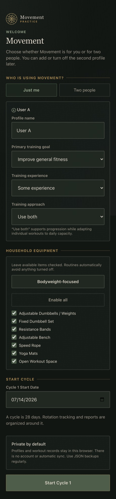
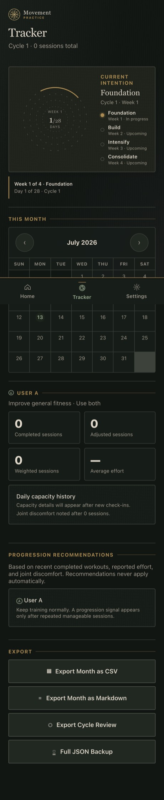

# Movement Practice

**A local-first, offline-capable movement tracker that adapts each day's workout to how your body actually feels.** No account, no server, no data ever leaves your device — built as a zero-runtime-dependency progressive web app in vanilla JavaScript.

<p>
  
  
  
  
</p>

### ▶︎ [Try the live demo](https://eli-studio.github.io/movement-practice/)

<p>
  
  
  
</p>

---

## What it is

Movement Practice runs a rotating, four-week strength/mobility program for one or two people. Before each session it asks a few quick questions — energy, soreness, joint pain, symptoms — and **adapts that day's plan to your reported capacity**: swapping or scaling movements, or dropping to a recovery routine, without losing your place in the cycle. It tracks weights and reps, times your rests and warm-ups, charts your trends across a cycle, and exports everything as JSON, CSV, or Markdown.

Everything is stored in the browser. There is no backend to run, nothing to sign up for, and no telemetry.

## Notable engineering

The parts worth a look if you're reviewing the code:

- **Offline-first PWA, zero runtime dependencies.** The entire app is hand-written ES modules + one vendored chart library. A [service worker](service-worker.js) precaches the app shell and serves it offline; a single cache-version constant is the only cache-busting mechanism.
- **An adaptive training engine.** [`adaptation.js`](js/adaptation.js) + [`rotation.js`](js/rotation.js) + [`cycles.js`](js/cycles.js) compose the daily plan from a capacity check-in, a symptom→exercise conflict matrix, available equipment, and where you are in the 28-day cycle.
- **Safe, structural data migration.** [`storage.js`](js/storage.js) forward-fills older saves against the current schema (nested count maps, per-profile fields), migrates a legacy storage key without stranding history, and validates imported backups field-by-field before trusting them.
- **Security-minded exports.** CSV cells are [neutralized against spreadsheet formula injection](js/exports.js) (`=`, `+`, `-`, `@`), all user text is HTML-escaped at the render layer, and the only permitted external link is an `https://open.spotify.com` allow-list.
- **Accessibility as a first-class concern.** `aria-pressed` toggles, an `aria-live` announcement region, visible focus indicators, `prefers-reduced-motion` support, 44px touch targets, and WCAG AA color contrast in both themes — with an automated contrast regression test guarding it.
- **iOS-safe audio unlocking.** [`audio.js`](js/audio.js) works around WebKit's gesture-gated `.play()` by pre-creating and unlocking every audio element on the first user tap.
- **A dependency-free release checker.** [`scripts/release-check.mjs`](scripts/release-check.mjs) validates JS syntax, the exercise/routine/equipment reference graph, version alignment, backup migration round-trips, and CSV safety — with no test framework.

See [ARCHITECTURE.md](ARCHITECTURE.md) for a tour of how a screen renders and how a day's plan is composed.

## Features

- One- or two-profile mode; add or remove the second profile any time without losing its history.
- Daily capacity check-in with transparent defaults (medium energy, low pain/soreness) that affect only that day.
- Rotating strength and adaptive routines, weight/rep tracking, rest and warm-up timers, and guided meditation.
- Interrupted-workout **Resume** and **Discard** recovery.
- Four-week cycle reports and readiness trends (charts via a locally vendored Chart.js).
- Full JSON backup + restore, plus per-month CSV/Markdown exports.
- Day and Night themes, applied before first paint to avoid a flash.

## Privacy and data

Records live in the current browser's `localStorage`. There is no account, server, upload, or device sync, and different browsers/devices/hostnames keep separate data. Because a browser can evict local storage, use **Tracker → Full JSON Backup** regularly and restore it on each device you use.

## Health notice

Adaptations and readiness labels are app-defined training heuristics, **not medical advice**. Stop exercising and seek appropriate medical help for chest pain, faintness, sharp pain, or severe or new symptoms.

## Run it locally

The app is fully static but needs an HTTP server (browsers block ES modules and `fetch` over `file://`):

```bash
npm run serve      # zero-dependency static server → http://127.0.0.1:4174
```

## Testing

```bash
npm test           # dependency-free release checks (syntax, data graph, migration, CSV safety)
npm run test:e2e   # Playwright behavioral smoke tests (onboarding, navigation, export, a11y contrast)
```

`npm test` has no dependencies and gates every pull request. The Playwright suite is a dev-only add-on — it does not affect the shipped, zero-dependency app.

## Deployment

Pushing to `main` deploys via GitHub Actions. In **Settings → Pages**, set **Source** to **GitHub Actions**. Chart.js is vendored locally, so the deployed app makes no third-party network requests and works fully offline after the first visit.

Audio assets are intentionally excluded from this public build: the app never requests missing files, chime controls are hidden, and warm-up/meditation timers run silently. Public content identifiers use neutral `strength_*` / `adaptive_*` namespaces, and older backups are migrated by structure so their history stays usable.

## Changelog

Release history is in [CHANGELOG.md](CHANGELOG.md).

## License

[MIT](LICENSE) © 2026 Eli Duffy.
