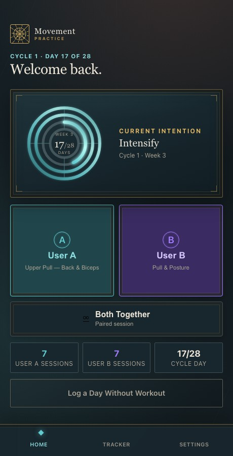
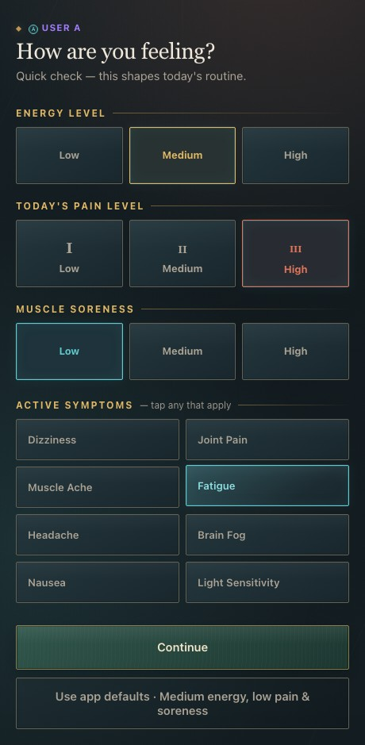
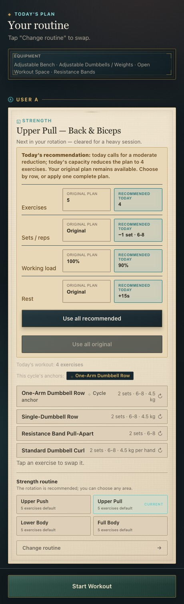
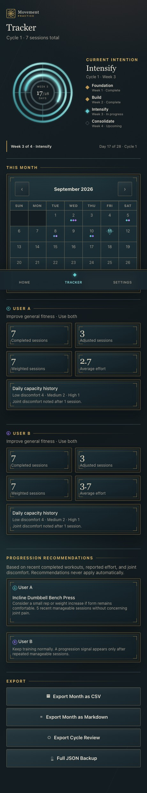

# Movement Practice

**A local-first, offline-capable movement tracker that adapts each day's workout to how your body actually feels.** No account, no server, and no transmission of workout data — built as a zero-runtime-dependency progressive web app in vanilla JavaScript.

<p>
  
  
  
  <a href="https://github.com/Eli-Studio/movement-practice/actions/workflows/release-checks.yml"></a>
</p>

### ▶︎ [Try the live demo](https://eli-studio.github.io/movement-practice/)

<p>
  
  
  
  
</p>

<sub>Screenshots use deterministic fictional sample data generated by <code>npm run screenshots</code>.</sub>

---

## What it is

Movement Practice runs a rotating, four-week strength/mobility program for one or two people. Before each session it asks a few quick questions — energy, soreness, joint pain, symptoms — and **adapts that day's plan to your reported capacity**: swapping or scaling movements, or dropping to a recovery routine, without losing your place in the cycle. It tracks weights and reps, times your rests and warm-ups, charts your trends across a cycle, and exports everything as JSON, CSV, or Markdown.

Everything is stored in the browser. There is no backend to run, nothing to sign up for, and no telemetry.

## Why I built it

Movement Practice began as a tool for my partner and me. We wanted to follow the same four-week practice while adapting each day for different energy, soreness, chronic pain symptoms, and available equipment—without treating recovery as failure or losing our place in the cycle.

That constraint shaped the two-profile model, local-first storage, shared-equipment handling, and the adaptation engine.

## Design language

Movement is the first working expression of a candidate Home OS design system:
ancient technology made practical and humane. Night mode is the reference—a
rain-dark stone sanctuary with structural brass and scarce teal/amethyst mineral
light. Day mode is the same artifact uncovered in sunlight, using parchment,
weathered stone, and dark technological inlays rather than a mechanical inversion.

Shared foundations live in [`home-os-tokens.css`](home-os-tokens.css); profile
identity, activity colors, the concentric cycle instrument, timer labyrinths, and
workout hardware remain Movement-owned. The rationale and promotion criteria are
recorded in the [token incubation decision](docs/decisions/2026-09-10-home-os-token-incubator.md).

## Notable engineering

The parts worth a look if you're reviewing the code:

- **Offline-first PWA, zero runtime dependencies.** The entire app is hand-written ES modules + one vendored chart library. A [service worker](service-worker.js) precaches the app shell, serves it offline, and prunes only Movement-owned caches. Its cache version controls shell upgrades; versioned stylesheet URLs identify design revisions.
- **An adaptive training engine.** [`adaptation.js`](js/adaptation.js) + [`rotation.js`](js/rotation.js) + [`cycles.js`](js/cycles.js) compose the daily plan from a capacity check-in, a symptom→exercise conflict matrix, available equipment, and where you are in the 28-day cycle.
- **A layered, accessible design system.** Candidate `--home-os-*` foundations define shared semantic roles while Movement owns its ritual instruments and profile identity. Dependency-free checks validate the token graph and shared contrast; Playwright checks rendered controls in both themes.
- **Safe, structural data migration.** [`storage.js`](js/storage.js) forward-fills older saves against the current schema (nested count maps, per-profile fields), migrates a legacy storage key without stranding history, and validates imported backups field-by-field before trusting them.
- **Security-minded exports and links.** CSV cells are [neutralized against spreadsheet formula injection](js/exports.js) (`=`, `+`, `-`, `@`), all user text is HTML-escaped at the render layer, user-configured links are restricted to an `https://open.spotify.com` allow-list, and the About card contains one fixed author link to GitHub.
- **Accessibility as a first-class concern.** `aria-pressed` toggles, an `aria-live` announcement region, visible focus indicators, `prefers-reduced-motion` support, 44px touch targets, and WCAG AA color contrast in both themes — with an automated contrast regression test guarding it.
- **A dependency-free release checker.** [`scripts/release-check.mjs`](scripts/release-check.mjs) validates JS syntax, the exercise/routine/equipment reference graph, the Home OS token contract, Night/Day shared-role contrast, version alignment, backup migration round-trips, and CSV safety — with no test framework.

See [ARCHITECTURE.md](ARCHITECTURE.md) for a tour of how a screen renders and how a day's plan is composed.

## Features

- One- or two-profile mode; add or remove the second profile any time without losing its history.
- Daily capacity check-in with transparent defaults (medium energy, low pain/soreness) that affect only that day.
- Rotating strength and adaptive routines, weight/rep tracking, rest and warm-up timers, and guided meditation.
- Interrupted-workout **Resume** and **Discard** recovery.
- Four-week cycle reports and readiness trends (charts via a locally vendored Chart.js).
- Full JSON backup + restore, plus per-month CSV/Markdown exports.
- Day and Night ritual themes, applied before first paint to avoid a flash.

## Privacy and data

Records live in the current browser's `localStorage`. There is no account, server, upload, or device sync, and different browsers/devices/hostnames keep separate data. Because a browser can evict local storage, use **Tracker → Full JSON Backup** regularly and restore it on each device you use.

## Health notice

Adaptations and readiness labels are app-defined training heuristics, **not medical advice**. Stop exercising and seek appropriate medical help for chest pain, faintness, sharp pain, or severe or new symptoms.

## Run it locally

The app is fully static but needs an HTTP server (browsers block ES modules and `fetch` over `file://`):

```bash
npm run serve      # zero-dependency static server → http://127.0.0.1:4174
```

## Testing

```bash
npm test           # release checks (syntax, data graph, tokens, contrast, migration, CSV safety)
npm run test:e2e   # Playwright behavioral smoke tests (flows, export, a11y, cycle graphics)
npm run screenshots # regenerate the curated README gallery and social preview
```

`npm test` has no dependencies and gates every pull request. The Playwright suite is a dev-only add-on — it does not affect the shipped, zero-dependency app.

## Deployment

Pushing to `main` deploys through [the GitHub Pages workflow](.github/workflows/pages.yml). Forks must set **Settings → Pages → Source** to **GitHub Actions**. Chart.js is vendored locally, so the deployed app makes no third-party network requests and works fully offline after the first visit.

Audio assets are intentionally excluded from this public build: the app never requests missing files, chime controls are hidden, and warm-up/meditation timers run silently. Public content identifiers use neutral `strength_*` / `adaptive_*` namespaces, and older backups are migrated by structure so their history stays usable.

## Changelog

Release history is in [CHANGELOG.md](CHANGELOG.md).

## License

[MIT](LICENSE) © 2026 Eli Duffy.
